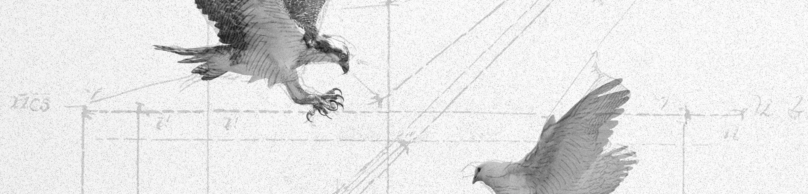

# Bird Game

A competitive game where players predict the future location of a dove pursued by falcons. Using probabilistic models, participants submit forward density predictions to optimize accuracy and maximize rewards. The game blends strategy, real-time decision-making, and statistical forecasting.
