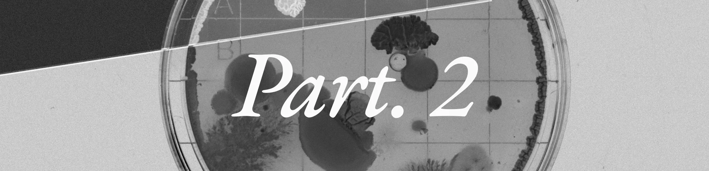

# Autoimmune Disease Machine Learning Challenge #2

Crunch Lab, The Eric and Wendy Schmidt Center, and The Klarman Cell Observatory invite you to join the Autoimmune Disease ML Challenge to design algorithms to help millions of people.

# Links

- [Overview](https://hub.crunchdao.com/competitions/broad-2)
- [Rules](https://hub.crunchdao.com/competitions/broad-2/rules)
- [Documentation](https://docs.crunchdao.com/competitions/competitions/broad-institute-autoimmune-disease/crunch-2)
- [Discussion](https://forum.crunchdao.com/c/competition/broad-3/19)
